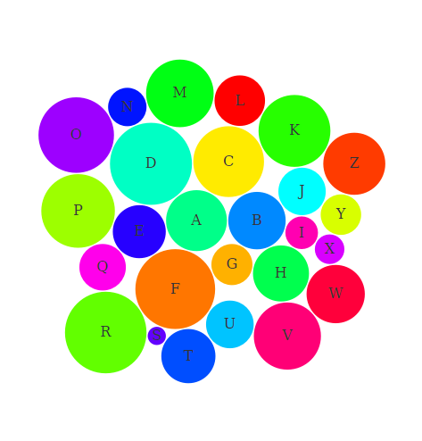

# d3.js bubble chart htmlwidget for R

This R package provides a bubble chart as seen in [this Mike Bostock example](http://bl.ocks.org/mbostock/4063269). It is based on [htmlwidgets](http://htmlwidgets.org) so it can be used from the R console, RStudio, R Markdown documents, and Shiny applications.

## Installation

Use the **devtools** package (`install.packages("devtools")`) to install this package directly from GitHub:

```r
devtools::install_github("jcheng5/bubbles")
```

## Usage

```r
library(bubbles)

bubbles(value = runif(26), label = LETTERS,
  color = rainbow(26, alpha=NULL)[sample(26)]
)
```



See `?bubbles::bubbles` for more options. For use with Shiny, see `?bubbles::renderBubbles`.
